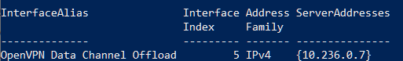
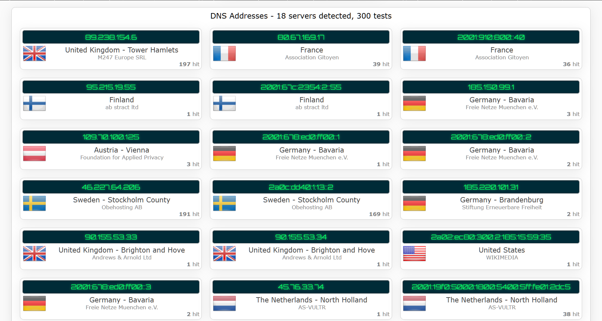

### 🇬🇧 [English version of this documentation](./README.en.md)

# autodnscrypt

[](https://go.dev)
[](https://github.com/mascotmascot1/autodnscrypt/releases/latest)
[](https://github.com/mascotmascot1/autodnscrypt)
[](https://github.com/mascotmascot1/autodnscrypt/blob/main/LICENSE)


> ⚠️ **Отказ от ответственности:*- Этот проект не связан с разработчиками [`dnscrypt-proxy`](https://github.com/DNSCrypt/dnscrypt-proxy), не поддерживается и не одобрен ими.

> ⚠️ **Примечание:*- Утилита разработана специально для систем **Windows**. Она использует PowerShell для изменения настроек DNS и предполагает наличие установленного `dnscrypt-proxy` для Windows.

## 🧭 Назначение

`autodnscrypt` создан для упрощения использования `dnscrypt-proxy` в Windows, особенно в сценариях с VPN или виртуальными сетевыми интерфейсами, которые получают новый IP-адрес при каждом подключении.

В таких случаях привязка `dnscrypt-proxy` к `127.0.0.1` или `:53` часто приводит к сбоям в работе DNS, так как виртуальные адаптеры (например, используемые OpenVPN) не могут обращаться к `localhost`. Эта утилита решает проблему следующим образом:

- Автоматически определяет текущий IPv4-адрес указанного интерфейса.
- Обновляет файл конфигурации `dnscrypt-proxy.toml`, привязывая `dnscrypt-proxy` именно к этому IP.
- Использует PowerShell для установки этого IP в качестве DNS-сервера для данного интерфейса.
- Запускает `dnscrypt-proxy.exe`.

Хотя инструмент оптимизирован для динамических интерфейсов, он поддерживает и статические — просто укажите правильное имя интерфейса (`interfaceName`) в файле `config.yaml`.

Это исключает необходимость ручной настройки и обеспечивает стабильную работу dnscrypt, т.е. перенаправление и шифрование (к примеру DoH - DNS over HTTPS) DNS-трафика  через правильный сетевой интерфейс.

> ⚠️ **Примечание:*- Этот инструмент не настраивает сам `dnscrypt-proxy` — такие функции, как DoH или TCP-only, должны быть включены вручную в `dnscrypt-proxy.toml`. `autodnscrypt` фокусируется исключительно на привязке к правильному интерфейсу и установке маршрутизации DNS.

## 📂 Структура проекта


```

project/
├── cmd/
│   └── autodnscrypt/
│       └── main.go # точка входа
├── internal/
│   └── dnscrypt/
│       ├── config.go # загрузка config.yaml  
│       ├── ip.go # получение IPv4 адреса интерфейса          
│       ├── update.go # обновление dnscrypt-proxy.toml       
│       └── launch.go # запуск исполняемого файла и настройка DNS 
├── screenshots/
│       ├── dnscryptlaunch.png
│       └── ipleakdns.png
├── scripts/
│       └── killdnscrypt.bat
├── config.yaml
├── go.mod
├── .gitignore
└── README.md

```

## ⚙️ Конфигурация

Настройки задаются через файл `config.yaml`, который должен находиться в **той же директории, что и скомпилированный бинарный файл**.

### Пример `config.yaml`:

```yaml
dnscryptConfigPath: "C:/Program Files/DNSCrypt/dnscrypt-proxy.toml"
dnscryptExePath: "C:/Program Files/DNSCrypt/dnscrypt-proxy.exe"
interfaceName: "OpenVPN Data Channel Offload"

# Примечание: Если вы используете обратные слеши (\) в путях Windows, их нужно экранировать.
# Пример:
# dnscryptExePath: "C:\\Program Files\\DNSCrypt\\dnscrypt-proxy.exe"
```

## 🚀 Как это работает

### `autodnscrypt`:

- Определяет IPv4-адрес интерфейса, указанного в `config.yaml`.
- Заменяет строку в `dnscrypt-proxy.toml`:
```
listen_addresses = [':53']
```

на:
```
listen_addresses = ['<ВАШ_IP>:53']
```

- Обновляет настройки DNS для интерфейса с помощью PowerShell:
  ```powershell
  Set-DnsClientServerAddress -InterfaceAlias "<InterfaceName>" -ServerAddresses <IP>
  ```

- Затем запускает `dnscrypt-proxy.exe`.

ℹ️ **Процесс выполнения**

После того как `autodnscrypt` завершит обновление конфига и настройку DNS, он запускает `dnscrypt-proxy.exe` в фоновом режиме и завершает свою работу.

Это нормальное поведение: утилита работает как инициализатор. Процесс `dnscrypt-proxy` продолжает работать независимо. Вы не увидите `autodnscrypt.exe` в диспетчере задач после запуска — так и должно быть.

Весь вывод (сообщения об успехе или ошибках) сохраняется в файл `log.txt` в **той же директории, где находится исполняемый файл**.  
Проверьте этот файл, если что-то работает не так, как ожидалось.

## 🧪 Проверка

Чтобы просмотреть текущие настройки DNS и убедиться, что изменения применились корректно, выполните следующую команду в PowerShell:

```powershell
Get-DnsClientServerAddress

```


Эта команда выведет список DNS-серверов для всех интерфейсов, что поможет подтвердить правильность настройки целевого адаптера.

### 📦 Подтверждение запуска прокси

На скриншоте ниже показан успешный запуск `dnscrypt-proxy.exe` в автономном режиме (не как служба Windows). Инициализировано несколько резолверов, локальный прокси DNS-сервер активен:


> ⚠️ **Примечание**: Этот скриншот сделан в версии **v1.0.0*- программы `autodnscrypt.exe`.  
> В той версии утилита выводила сообщения о статусе (например, `Configuration file successfully updated`) прямо в консоль.  
> Начиная с версии **v1.1.0**, все подобные сообщения пишутся исключительно в `log.txt`, а в окне терминала виден только вывод самого `dnscrypt-proxy.exe`.

### 🌍 Тест на утечку DNS — ipleak.net

Это подтверждает, что DNS-запросы разрешаются через настроенные безопасные резолверы (например, Франция, Финляндия, Германия), а не через системный DNS или провайдера:



## 🛠️ Сборка

Из корневой директории проекта вы можете собрать исполняемый файл двумя способами:

### 1. 🧱 Стандартная сборка (консольный режим)

```bash
go build -o autodnscrypt.exe ./cmd/autodnscrypt

```

Эта версия работает как обычное консольное приложение — при запуске на короткое время появится окно терминала.

### 2. 🪞 Скрытая сборка (без окна консоли)

```bash
go build -ldflags="-H windowsgui" -o autodnscrypt.exe ./cmd/autodnscrypt

```

Команда собирает `autodnscrypt.exe` как приложение типа `windowsgui` — оно запускается тихо в фоновом режиме, **не открывая окна терминала**.

> ⚠️ **Примечание:*- Убедитесь, что скомпилированный `.exe` файл находится в той же папке, что и `config.yaml`.

### 🗡️ Остановка скрытого процесса

Если вы собрали `autodnscrypt.exe` или запустили `dnscrypt-proxy.exe` с флагом `-ldflags="-H windowsgui"` (тихий режим), процесс будет работать **без видимого окна консоли**.  
Чтобы остановить его вручную, вы можете использовать включенный в проект скрипт `killdnscrypt.bat`.

> ⚠️ **Примечание:*- Скрипт ищет процесс с именем `dnscrypt-proxy.exe`.  
> Если ваш исполняемый файл называется иначе, откройте `.bat` файл в Блокноте и отредактируйте его вручную.

## ✅ Требования

- Go 1.20 или новее  
- Установленный `dnscrypt-proxy` (протестировано на версиях 2.1.8 и 2.1.12)  
- Windows с доступным PowerShell  
- Права администратора для настройки конфигурации DNS

## ⚠️ Важные заметки

- Запускайте исполняемый файл с правами администратора, чтобы PowerShell мог применить изменения DNS.
- Убедитесь, что `interfaceName` в точности совпадает с именем интерфейса, отображаемым в команде `ipconfig /all`.
