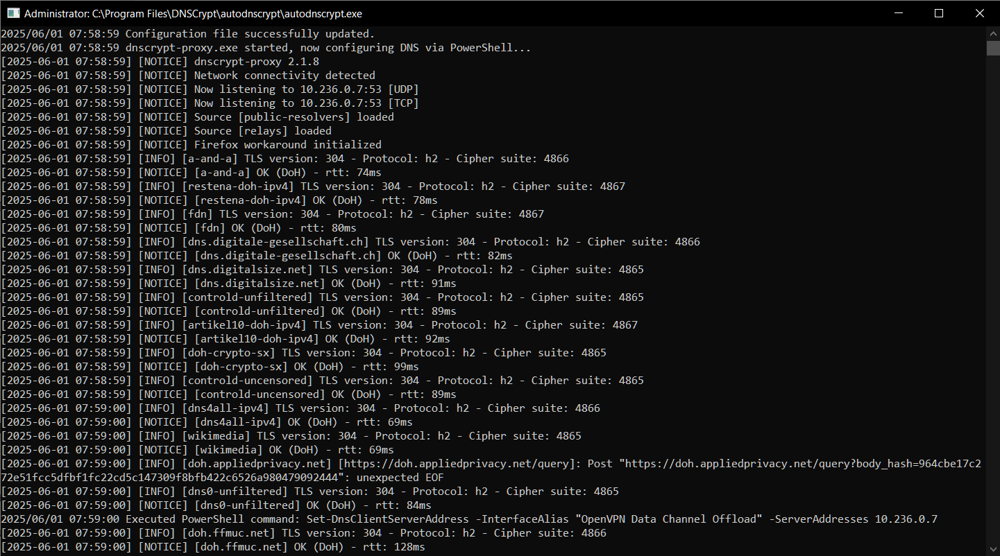

# autodnscrypt


[](https://github.com/mascotmascot1/autodnscrypt/releases/latest)


> ⚠️ **Disclaimer:** This project is not affiliated with, endorsed by, or maintained by the developers of [`dnscrypt-proxy`](https://github.com/DNSCrypt/dnscrypt-proxy).  

A small utility to automatically configure `dnscrypt-proxy` to listen on the current IPv4 address of a specified network interface, set the system DNS for that interface via PowerShell, and launch `dnscrypt-proxy.exe`.

> ⚠️ **Note:** This utility is designed specifically for **Windows** systems. It uses PowerShell to change DNS settings and assumes the presence of `dnscrypt-proxy` for Windows.

## 🧭 Purpose

`autodnscrypt` is designed to simplify the use of `dnscrypt-proxy` on Windows systems, especially in scenarios involving VPNs or virtual network interfaces that get a new IP address on each connection.

In such cases, binding `dnscrypt-proxy` to `127.0.0.1` or `:53` often causes DNS resolution to break, since virtual adapters (like those used by OpenVPN) cannot access `localhost`. This tool solves that by:

- Automatically detecting the current IP address of the specified interface.
- Updating the `dnscrypt-proxy.toml` config file to bind `dnscrypt-proxy` to that IP.
- Using PowerShell to set the interface’s DNS server accordingly.
- Launching `dnscrypt-proxy.exe`.

Although optimized for dynamic interfaces, the tool also supports static ones — simply provide the correct `interfaceName` in `config.yaml`.

This eliminates manual setup and ensures stable and reliable DoH (DNS over HTTPS) operation through the correct network interface.

Note: This tool does not configure `dnscrypt-proxy` itself — features like DoH/TCP-only must still be enabled manually in `dnscrypt-proxy.toml`. `autodnscrypt` focuses solely on binding it to the correct interface and setting up DNS routing.

## 📂 Project Structure

```
project/
├── cmd/
│   └── autodnscrypt/
│       └── main.go # entry point
├── internal/
│   └── dnscrypt/
│       ├── config.go # loading config.yaml  
│       ├── ip.go # retrieving IPv4 from interface          
│       ├── update.go # updating dnscrypt-proxy.toml       
│       └── launch.go # running executable and setting DNS 
├── screenshots/
│       ├── dnscryptlaunch.png
│       └── ipleakdns.png
├── scripts/
│       └── killdnscrypt.bat
├── config.yaml
├── go.mod
├── .gitignore
└── README.md
```

> Note: `vendor/` is intentionally excluded and listed in `.gitignore`.

## ⚙️ Configuration

The configuration is provided via `config.yaml`, which must reside in the **same directory as the built binary**.

### Example `config.yaml`:

```yaml
dnscryptConfigPath: "C:/Program Files/DNSCrypt/dnscrypt-proxy.toml"
dnscryptExePath: "C:/Program Files/DNSCrypt/dnscrypt-proxy.exe"
interfaceName: "OpenVPN Data Channel Offload"

# Note: If you use backslashes (\) in Windows paths, you must escape them.
# Example:
# dnscryptExePath: "C:\\Program Files\\DNSCrypt\\dnscrypt-proxy.exe"
```

## 🚀 What It Does

### `autodnscrypt`:

- Detects the IPv4 address of the interface named in `config.yaml`.
- Replaces the line in `dnscrypt-proxy.toml`:
  ```
  listen_addresses = [':53']
  ```

  with:
  ```
  listen_addresses = ['<IP>:53']
  ```

- Updates the DNS settings for the interface using PowerShell:
  ```powershell
  Set-DnsClientServerAddress -InterfaceAlias "<InterfaceName>" -ServerAddresses <IP>
  ```

- Then launches `dnscrypt-proxy.exe`.

ℹ️ **How it runs**

Once `autodnscrypt` finishes updating the config and setting the DNS server, it launches `dnscrypt-proxy.exe` in the background and then exits.

This is expected behavior: the utility is a one-time initializer. The `dnscrypt-proxy` process continues running independently. You won't see `autodnscrypt.exe` in Task Manager after launch — this is normal.

## 🧪 Verifying

To view current DNS settings and verify that the changes applied correctly, you can run the following command in PowerShell:

```powershell
Get-DnsClientServerAddress
```


This will list the DNS servers configured for all interfaces, helping confirm that your target interface is correctly set.

### 📦 Proxy Startup Confirmation

The following screenshot shows the `dnscrypt-proxy.exe` successfully starting in standalone mode (not as a Windows service). Multiple resolvers are initialized, and the local DNS listener is active:



### 🌍 DNS Leak Test — ipleak.net

This confirms that DNS queries are resolved through the configured secure resolvers (e.g., France, Finland, Germany), rather than your system DNS or ISP:


## 🛠️ Building

From the project root, you can build the executable in two ways:

### 1. 🧱 Standard build (console mode)

```bash
go build -o autodnscrypt.exe ./cmd/autodnscrypt
```

This version runs as a regular console application — a terminal window will appear briefly when you launch it.

### 2. 🪞 Silent build (no console window)

```bash
go build -ldflags="-H windowsgui" -o autodnscrypt_silent.exe ./cmd/autodnscrypt
```

This builds `autodnscrypt.exe` as a `windowsgui` application, which suppresses the terminal window on launch.
Functionality remains the same — it's just quieter for background use or scripting.
The same `-ldflags="-H windowsgui"` option can be used when building `dnscrypt-proxy.exe` to suppress its window as well.

> ⚠️ **Note:** Ensure the compiled `.exe` is in the same directory as `config.yaml`.

### 🗡️ Killing a Silent Instance

If you build `autodnscrypt.exe` or `dnscrypt-proxy.exe` with the `-ldflags="-H windowsgui"` flag (silent mode), the process will run **without a visible console window**.  
To stop it manually, you can use the included `killdnscrypt.bat` script.

> ⚠️ The script looks for a process named `dnscrypt-proxy.exe`.  
> If your executable has a different name, open the `.bat` file in Notepad and edit it manually.

## ✅ Requirements

- Go 1.20 or newer  
- `dnscrypt-proxy` installed  
- Windows with PowerShell available  
- Administrator privileges to set DNS configuration

## ⚠️ Notes

- Run the executable with administrator rights to allow PowerShell to apply DNS changes.
- Make sure `interfaceName` exactly matches the interface name shown in `ipconfig /all`.
